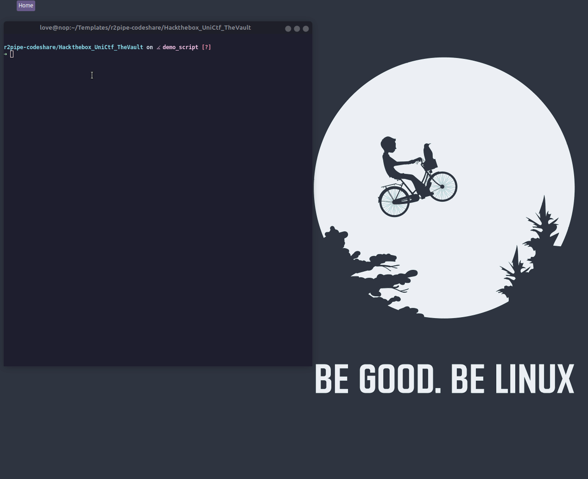

This solution script uses r2pipe to access radare2 using python.

The binary used here is from the challenge that I solved during Hackthebox University Ctf 2021 Qualifiers.

The sample r2pipe script opens the binary, analyzes it, 
finds the target function, sets breakpoint over there, and filters out parts of the flag on multiple iterations, 
appends them, and finally prints out the complete flag.

Demo:

Running this script:
1. Change directory to `Hackthebox_UniCtf_TheVault`
2. `chmod +x ./vault`
3. `python3 solution.py`

